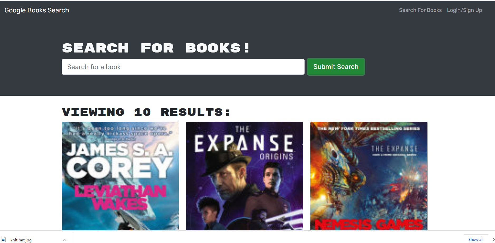

# Google Book Search
[](https://infinite-meadow-95462.herokuapp.com/)
  
[](https://opensource.org/licenses/mit)
  
## Description
to be able to search books on google
  
## Table of Contents
- [Installation](#installation)
- [Usage](#usage)
- [Screenshots](#screenshots)
- [Links](#links)
- [License](#license)
- [Questions](#questions)
  
## Installation
```md
npm install
```
  
## Usage
```md
navigate to website and enjoy
```
  
## Screenshots


## Links
https://infinite-meadow-95462.herokuapp.com/

https://github.com/ashiemotto/Google-book-search


  
## Reporting
```md
Github
```
## License
[](https://opensource.org/licenses/mit)
  
## Questions a
Add an issue through GitHub:
 https://github.com/Ashiemotto
  
Or using email:
Email: Ashheadley@gmail.com

